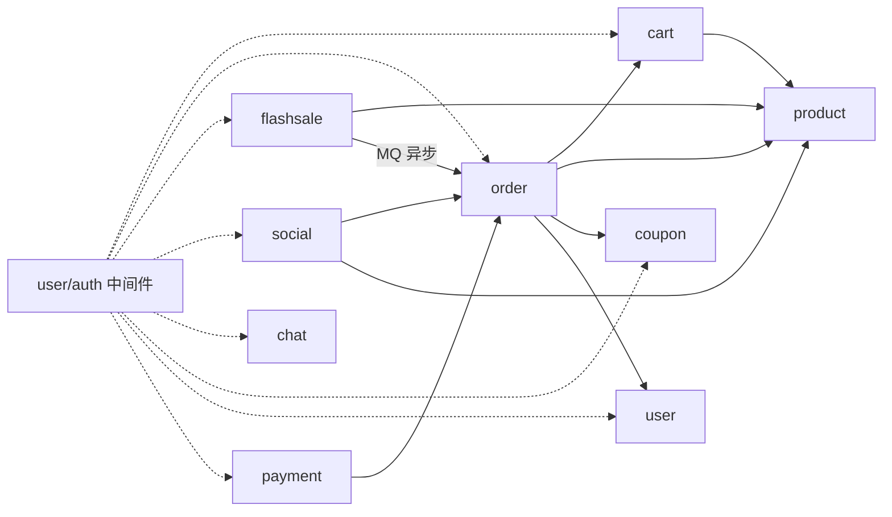

# 设计总览

## 架构

DDD 风格的模块化单体：单一部署单元承载商城、秒杀、后台、好友圈与即时通信模块；模块 = 限界上下文，repository 接口 = 端口，共享基础设施集中在 `internal/platform`。模块间经 service 接口进行进程内调用（面向接口，非 HTTP）+ 单向依赖（DAG，禁止循环），仅秒杀落单走 MQ 异步。
（见 ADR-0001 / 0003）

单体阶段 Nginx 反代即网关（路由 / SSL 终止 / 静态托管 / 入口限流）；拆微服务时才引入独立 API 网关（见 BACKLOG"明确不做"）。

## 学习点

- Go 语言：goroutine / channel / context、面向接口编程、错误处理、GC 与内存基础
- 工程实践：手写雪花 ID、Lua 原子脚本、模块化单体的模块边界、测试（testify）
- 面试题库：80-100 题按主题分章（Go 基础/并发/网络/MySQL/Redis/MQ/秒杀架构/认证安全/工程实践/部署运维/可观测性/容错与降级），存于 website/docs/tech/interview/，答案与代码随模块实现同步产出

## 技术栈

| 层 | 主选 | Backlog 备选 |
|---|---|---|
| Web | Gin | stdlib 路由 |
| WebSocket | gorilla/websocket（platform/ws，单向推送 + 心跳） | stdlib HTTP/2 WebSocket |
| ORM | GORM（之上包仓储接口） | sqlc |
| 数据库 | MySQL 8 | PostgreSQL |
| 缓存 | go-redis/v9 + Lua 脚本 | — |
| MQ | RabbitMQ | Kafka |
| 认证 | JWT 自签（HS256）+ bcrypt；TokenVerifier 接口 | session；第三方认证服务器（Keycloak/OIDC） |
| 对象存储 | MinIO | — |
| 日志 | zap（JSON 结构化） | slog |
| 配置 | viper | env |
| 校验 | go-playground/validator | — |
| 定时任务 | robfig/cron | asynq；RabbitMQ 延迟队列（超时取消更优解） |
| 限流 | golang.org/x/time/rate（令牌桶） | Redis 分布式限流 |
| 数据库迁移 | golang-migrate | — |
| API 契约 | 手写 TS 类型 + HTTP 集成测试（ADR-0006） | swaggo/swag；openapi-typescript |
| 测试 | testing + testify | — |
| 依赖注入 | 手写（service 组装） | wire |
| 反向代理 | Nginx（预写 upstream 双实例示例） | 多实例 LB 实操 |
| 前端工具链 | bun + Vite + React + TS + Tailwind v4 + react-router + TanStack Query + zustand + axios | npm/pnpm 备选 |
| 文档站 | Docusaurus（Cloudflare Pages 部署） | VitePress |
| 可观测性 | Prometheus + Grafana（指标）、Loki（日志聚合） | OpenTelemetry + Jaeger（链路） |
| 容错 | context 超时 + 有限重试 + gobreaker 熔断 + 缓存兜底降级 | 舱壁 / Sentinel-golang |

## 项目结构

```
go_single/
├── cmd/
│   └── server/main.go            # 入口：装配所有模块
├── internal/
│   ├── user/                     # 用户与认证（JWT）+ 地址簿
│   │   ├── handler/  service/  repository/(接口)  model/
│   ├── product/                  # 商品(SPU) / SKU / 类目
│   ├── cart/                     # 购物车，条目引用 SKU
│   ├── order/                    # 订单 + 状态机 + 地址快照（普通/秒杀共用）
│   ├── flashsale/                # 秒杀活动（独立库存+秒杀价+时间窗口+下架+限购）+ Lua 预扣
│   ├── payment/                  # 模拟支付（成功/失败回调 + 流水幂等）
│   ├── coupon/                   # 优惠券：券模板(admin) / 领券 / 下单核销；与秒杀互斥
│   ├── social/                   # 好友（申请/通过）+ 好友圈动态（仅好友可见，购买后可分享）
│   ├── chat/                     # WebSocket 单聊（JWT 握手认证），文本/图片/文件消息，落库+离线拉取
│   └── platform/                 # 共享基础设施
│       ├── config/  logger/  metrics/  auth/  limiter/  cors/  cron/
│       ├── mq/  cache/  ws/  file/(MinIO)
├── web/                          # 演示前端总目录（多主题，工程级插拔）
│   ├── faire/                    # 主题 "faire"：独立 Vite 工程
│   │   ├── src/                  # 该主题专属组件/页面（可整体重写）
│   │   ├── design/               # 四件套：DESIGN.md / CSS_Variables.css / Design_Tokens.json / Tailwind_V4.css
│   │   ├── vite.config.ts        # dev proxy /api、/ws → 后端；VITE_API_BASE / VITE_WS_BASE 可配置
│   │   └── public/_redirects     # Cloudflare Pages SPA fallback（置于 public/ 随构建拷入 dist）
│   ├── <theme-b>/                # 未来第二套主题（克隆骨架再改）
│   └── README.md                 # 主题清单 + 接入约定
├── website/                      # Docusaurus 文档站（Cloudflare Pages 独立部署）
│   ├── docs/
│   │   ├── user-guide/           # 用户文档（任务导向）
│   │   └── tech/
│   │       ├── modules/          # 镜像 internal/：每模块一节（数据模型/接口/时序）
│   │       ├── domains/          # 镜像 CONTEXT.md 领域分组：模块↔领域映射（薄视图）
│   │       └── interview/        # 面试题库（分章，随模块实现同步产出）
│   └── docusaurus.config.ts
├── migrations/                   # golang-migrate SQL
├── configs/                      # viper yaml
├── deploy/
│   ├── docker-compose.yml        # mysql/redis/rabbitmq/minio/nginx/prometheus/grafana/loki/promtail（不含前端构建，宿主 bun build 后挂载 dist）
│   ├── nginx/nginx.conf          # 托管选定主题 dist + /api 反代 + try_files SPA fallback + upstream 双实例示例
│   └── monitoring/               # prometheus.yml、grafana datasource/仪表盘 provisioning、promtail 配置
├── docs/                         # 工程决策权威源：adr/ backlog design
└── go.mod
```

**admin 管理入口不设独立模块**：product/order/flashsale/coupon 各自内联 `/api/admin/*` 路由组（`auth.Middleware` + `auth.RequireAdmin`，非 admin 403），业务逻辑复用各模块 service——admin 只做入口与 role 鉴权（对应 spec 实现决策），避免独立 admin 模块反向依赖全部业务模块的扇入结构。

## 前端（演示前端）

- **定义**：工程级插拔——每套主题 = `web/` 下独立 Vite 工程，共享同一后端（契约：REST 接口，json tag ↔ 手写 TS 类型 + HTTP 集成测试，见 ADR-0006），互不依赖；换主题 = 部署时选一套构建
- **主题资产**：四件套放 `web/<theme>/design/`——DESIGN.md（设计规范，供人/AI 参考）/ CSS_Variables.css / Design_Tokens.json（W3C DTCG）/ Tailwind_V4.css（`@theme`）；组件代码一律用语义化 Tailwind 类，不写死颜色
- **工具链**：bun（`bun install` / `bun run dev` / `bun run build`）；Vite dev proxy 把 `/api`、`/ws` 转发到后端 :8080
- **API 对接**：HTTP base 由 `VITE_API_BASE` 控制（dev 用 `/api` 代理，云端构建传后端绝对地址）；WebSocket 地址由 `VITE_WS_BASE` 控制（dev 用 `/ws` 代理）；后端 `platform/cors` 中间件允许前端域名（跨源场景）
- **私有媒体**：统一后端代理——`POST /api/files` 将图片（png/jpeg/webp/gif，魔数校验，≤5 MiB）或普通文件（PDF/ZIP/TXT/CSV/MD，≤20 MiB）写入 MinIO 私有桶，返回 `/files/<opaque-ref>` 托管引用；Nginx 与后端均以 21 MiB 作为 multipart 请求硬上限（为 20 MiB 文件预留 1 MiB 开销），后端解析仅保留 1 MiB 内存，超限返回 413；每用户累计字节与对象数先在 MySQL 原子预留，默认 512 MiB/1000 个，防止合法重复上传无限占用存储。引用固化上传者与 `image/file` 类型，头像/动态/消息保存前校验归属与类型。`GET /api/files/:reference` 经 Bearer 代理读取：头像对登录用户可见，动态图片跟随好友关系，聊天媒体仅会话双方可读；前端以 Axios 拉取 Blob 展示/下载，不直连 MinIO（presigned 直传明确不做）
- **页面清单**（演示前端功能范围，各主题通用）：
  - 登录/注册 → user；首页（商品列表）→ product；商品详情 → product + cart；购物车 → cart + product
  - 结算（下单）→ order + user(地址簿) + coupon；订单列表/详情 → order；秒杀页 → flashsale
  - 优惠券中心 → coupon；好友列表/申请 → social；好友圈 → social；聊天 → chat
  - 个人中心（个人资料：昵称/头像，头像经 `POST /api/files` 上传 + `PATCH /api/users/me` 写入；地址簿）→ user；后台管理 → product/order/flashsale/coupon 内联 admin 路由组（role 鉴权）
- **交互约定**：秒杀提交携带 `client_request_id`，返回"排队中"与 `pre_deduction_id`，前端轮询 `GET /api/flashsales/purchases/{pre_deduction_id}`（1.5s×30 次上限）直到 `ordered` / `rolled_back`；同一请求 ID 重试返回原生命周期，新请求 ID 在 `per_user_limit` 内分配新购买槽位；秒杀页倒计时由列表接口携带服务端时间；接口 401 时前端跳转登录；演示账号 admin/admin123（user-guide 同步写明）
- **路由**：react-router v7；面向用户的页面与后台管理（admin）按角色分组，admin 路由加 role 守卫（前端隐藏 + 后端兜底）
- **状态管理**：TanStack Query（服务端状态：API 数据缓存、秒杀轮询、好友圈分页）+ zustand（客户端状态：登录态、用户信息、聊天连接）
- **API client**：axios + 拦截器——统一携带 JWT（Authorization 头）、401 统一跳登录、错误统一处理
- **JWT 存储**：localStorage（学习项目取舍；cookie 方案与 CSRF 讨论进 backlog）
- **WS 握手**：浏览器以 `Sec-WebSocket-Protocol: bearer, <jwt>` 携带凭据，JWT 不进入 URL；Nginx 访问日志只记录 path，Promtail 入 Loki 前再次脱敏
- **组件策略**：手写组件 + 语义化 Tailwind 类（主题定制自由，与四件套主题机制契合）；shadcn/ui 进 backlog
- **TS 类型**：api 层手写类型对齐后端 json tag（tsc 构建期校验）+ HTTP 集成测试固定响应形状（ADR-0006）；openapi-typescript 自动生成进 backlog
- 布局策略：桌面优先，不做移动端适配（演示项目）
- **部署双路径**：
  - 本地演示（同源）：Nginx 托管选定主题的构建产物（`web/<theme>/dist`）+ `location /api` 反代 :8080 + `try_files` SPA fallback；SSL 终止（自签证书）+ 安全头（T28，deploy/nginx/gen-certs.sh）
  - 云端（Cloudflare Pages，前端可独立部署）：静态 SPA + `_redirects`（`/* → /index.html 200`，置于 `public/`）+ `VITE_API_BASE` 跨源
  - 接线与演示命令见 docs/DEPLOYMENT.md（部署指南），平台选型见 ADR-0005
- 第二套主题以第一套为骨架克隆（api 层/路由/页面框架复用，设计层重写）；`web/shared/` 公共层等到出现第二套主题再抽（YAGNI）

## 订单状态机（普通/秒杀共用）

待支付 → 已支付 → 已发货 → 已完成；含取消与超时取消。状态迁移仅允许合法跃迁（如 待支付→已支付），非法迁移直接拒绝。

订单表含 `order_type`（normal/seckill）：普通订单与秒杀订单共用状态机；秒杀订单不使用优惠券，`purchase_slot` 固化预扣槽位，`user_activity_key=user_id:activity_id:purchase_slot` 唯一约束只拦同槽重投；取消后置 NULL 释放该槽位。

- 待支付 → 已支付：支付回调
- 已支付 → 已发货：后台发货
- 已发货 → 已完成：用户确认收货（用户侧"确认收货"接口）
- 待支付 → 已取消：用户取消 / 超时未支付自动取消

## 普通订单流程

```
购物车/商品直购 → 校验并下单（事务：订单 + 订单项 + 库存扣减 + 地址快照 + 券核销 + 删除购物车条目）
  → 待支付 → 支付回调 → 已支付 → 后台发货 → 已发货 → 用户确认收货 → 已完成
  → 超时未支付（cron）→ 取消 → 回补库存 + 回退券
```

- **库存扣减时机**：下单即扣（与秒杀同原则：下单即扣、超时回补）；扣减用条件更新（`UPDATE sku SET stock=stock-N WHERE stock>=N`）防超卖
- **幂等**：下单接口携带 `client_request_id`；MySQL 唯一约束 `(user_id, client_request_id)` 保存持久请求事实，Redis SETNX + TTL 15min 仅协调在途请求。Redis 丢失或 TTL 到期后重试仍返回原订单
- **金额安全**：SKU 与秒杀成交价上限为 100,000,000 分（100 万元）；订单项乘法与订单总额累加使用检查运算，金额关系和逐项小计在扣库存前验证，并由数据库 `CHECK` 约束兜底
- **订单号**：雪花 ID（手写实现，学习点）
- **地址快照**：下单时从地址簿选择地址固化为订单副本，用户后续改地址不影响历史订单
- **超时取消**：默认 普通订单 15min / 秒杀订单 10min（实现期可调）

## 秒杀时序（Redis 预扣为准）

```
[1] 限流（全局令牌桶 + 按用户限流）
[2] 以 (user, activity, client_request_id) 幂等创建 preparing 预扣事实，固化 SKU/成交价/数量；
    pre_deduction_id 同时作为购买槽位，Redis 槽位键以该 ID 为值抢占（TTL 30min）
[3] 缓存适配器原子预扣（内部 Lua：活动窗口/status/限购 + DECR 库存 + INCR 用户计数
    + 写 flashsale:reservation:{pre_deduction_id}）；成功后事实转 pending_publish
[4] 持久化雪花订单号 → 发布 MQ；确认成功转 pending_order，失败保留 pending_publish。启动恢复与每分钟任务
    发布前先原子验证 reservation marker；若 Redis 在 AOF fsync 前重启导致整次 Lua 结果回退，则按持久事实重建
    库存/计数/幂等键/marker，再复用同一订单号发布；仅 pending_publish 累计 10 次仍失败才转 pending_rollback，
    broker 已确认的 pending_order 持续等待消费或永久失败回退；返回 202 + pre_deduction_id
[5] 消费者由 flashsale 编排：锁定预扣事实 → 开启数据库事务 → order.CreateSeckillInTx 建秒杀订单与订单项
    → 消息与持久快照逐字段校验，订单使用预扣时 SKU/价格/数量/槽位 → flashsale 活动仓储条件扣活动库存；
    user_activity_key=user:activity:slot 唯一约束只兜底对应槽位的重复投递
    → 同事务将预扣事实转 ordered（仅非取消订单占位，重复即幂等成功且不重复扣库存）
    永久失败先转 pending_rollback 再进入 DLQ；死信消费者补写回退意图，恢复任务完整回退
[6] 支付回调（状态机校验）→ 已支付（随后与普通订单一致走发货/确认收货）
[7] 超时未支付（cron 扫描；RabbitMQ 延迟队列为更优解，进 backlog）
    → flashsale 编排读取 order 超时快照 → 同事务条件取消订单 + 回补 MySQL 活动库存
    + 将预扣事实转 pending_rollback → 提交后立即尝试 Redis 回补；失败持久计数并由恢复任务重试
```

- **库存事实源**：秒杀期以 Redis 预扣为准；活动库存落单时同步扣减、取消时回补，用于对账
- **可恢复生命周期**：`flashsale_pre_deductions` 是逐购买槽位的持久事实源，包含 `client_request_id`、SKU、成交价、数量和槽位，状态为 `preparing → pending_publish → pending_order → ordered → pending_rollback → rolled_back`；所有影响终态的 Redis Lua 都在同一专用连接上紧跟 `WAITAOF`，只有本地 AOF 明确 fsync 后才推进 MySQL 状态或释放 marker。回退先写 `rolled_back` tombstone，MySQL 写入终态后再清理；ordered 事实也会在启动和 cron 中重建/验证库存、计数、槽位键和 marker。取消只回补对应 marker 并将该订单 `user_activity_key` 置 NULL，不影响同一用户的其他槽位
- **升级兼容**：pre-R04 的 durable 主队列/DLQ 消息缺少 `pre_deduction_id` 时，消费者按 `order_no` 收编为 legacy 生命周期，再执行落单或持久回退，不直接丢弃
- **限购**：`per_user_limit=N` 表示同一用户最多持有 N 个有效购买槽位；同请求 ID 重试不新增槽位，取消一个槽位后计数减一并可补购

## 秒杀活动

- 字段：`start_at` / `end_at` / `status`（上架/下架）/ `stock`（活动独立库存）/ `price`（秒杀价）/ `per_user_limit`
- **库存模型**：活动独立库存，与 `sku.stock`（普通订单库存）互不干扰；落单扣活动库存；对账 = Redis 活动库存 vs `flashsale.stock` vs 秒杀有效订单数
- **上架与编辑**：未开始活动可覆盖预热库存；进行中只允许改标题和减少库存，SKU、价格、时间窗口、限购锁定。库存编辑先用 Redis pause key 原子封住新预扣，再锁 MySQL 活动行重读库存、校验不得低于已接受预扣，事务提交“新库存 + 临时下架”后按锁内差额持久扣 Redis，成功才恢复上架并解封；进程中断或任一基础设施步骤失败都保持下架，不会在 Redis 未同步时继续售卖
- **Redis key 约定**：`flashsale:stock:{id}` / `flashsale:count:{id}:{user}` / `flashsale:idem:{id}:{user}:{purchase_slot}` / `flashsale:reservation:{pre_deduction_id}` / `flashsale:pause:{id}` / `flashsale:rl:{user}`（按用户限流计数，固定窗口 INCR+TTL）
- 状态判定：进行中 = `status=上架 && start_at <= now <= end_at`（时间窗口动态判定，不显式翻转）；`status` 仅用于手动下架/紧急停止

## 模拟支付

- 接口形态：外部 API 端点 `POST /api/payments/mock {order_id, payment_id, amount, result: success|fail}`（前端订单详情页"模拟支付"按钮或 curl 调用）→ payment handler → payment service → 进程内调用 order service 驱动状态流转；`payment_id` 为客户端生成的支付流水号（每次尝试重新生成），`amount` 为回调申报金额（分）
- 成功：状态机校验（仅 待支付→已支付 合法）+ 支付流水表唯一约束（payment_id，重复回调 409）+ 金额核对（回调金额 = 应付金额，不符 409）+ 支付期限校验（`expire_at > paid_at`）；状态、金额和期限在同一条件更新中原子裁决
- 失败：订单停留待支付，记录失败流水，允许重试支付（待支付 状态内可重复发起，重试须用新 payment_id）
- 归属：owner 校验先于流水检查（防 IDOR，他人订单 403）；流水落库与订单状态迁移同一事务

## 优惠券（与秒杀互斥）

- **券模板**（admin 配置）：类型（直减/满减）、面额、满减门槛、总量、每人限领、有效期
- **领券**：类型化缓存能力以 MySQL 已领数为基线重建缺失/落后计数，并在内部 Lua 检查每人限领与总量后 INCR；MySQL 事务锁定券模板，锁后重取当前时间并检查有效期、总量和每人限领后落库，是 Redis 丢失、陈旧或不可用时仍不超发的最终约束；每次数据库裁决后按总计数/当前用户计数各自的版本同步缓存，过期快照不能覆盖较新事实
- **核销**：下单时可选券 → 订单事务内核销（券使用记录）→ 取消订单回退；一单一张券，满减门槛在结算时校验
- **金额**：订单记 `discount_amount`，应付金额 = 商品总额 − 券额；支付回调核对应付金额
- **互斥**：秒杀订单不使用优惠券；全场券，不做商品维度限制

## 认证与权限

- JWT 自签（HS256）+ bcrypt 密码哈希；`platform/auth` 定义 TokenVerifier 接口（轻量 seam，不属于 ADR-0003 三类；自签实现，OIDC/第三方认证服务器换实现即可，进 backlog）。登录与注册在 bcrypt 前按可信来源 IP/与 MySQL 唯一索引排序规则一致的账号权重执行 Redis 固定窗口限流；未知账号使用固定 cost 的 dummy hash 完成同一次 bcrypt 比较，避免已知/未知账号失败形成明显时序探针
- JWT 有效期 2h，无 refresh（refresh token 进 backlog）
- `user.role`（`user`/`admin`）+ admin 路由中间件校验，不另起认证体系；admin 账号由 migration 种入默认管理员
- WebSocket 握手携带 JWT 校验身份；已建立连接在 JWT 到期时以关闭码 4001 主动断开，重连必须重新鉴权

## 安全设计

- **对象级授权（越权防护）**：所有资源查询/变更强制校验归属——订单、购物车、地址簿、聊天消息、好友操作均校验 `owner_id`，禁止跨用户访问（IDOR）
- **HTTPS 与安全头**：Nginx 终止 SSL（本地演示可自签证书）；响应加 `X-Content-Type-Options` / `X-Frame-Options` / `Content-Security-Policy` 等安全头
- **请求与上传预算**：JSON 路由在解析前最多读取 64 KiB（包括伪造 Content-Type 的请求）；`POST /api/files` 不信任客户端 MIME，multipart 总体硬上限 21 MiB，图片按魔数校验 png/jpeg/webp/gif 且 ≤5 MiB，普通文件限定 PDF/ZIP/TXT/CSV/MD 且 ≤20 MiB。上传先原子预留每用户累计字节/对象数配额，再写 MinIO，写入失败释放额度；返回托管引用而非 MinIO URL。头像、动态和消息拒绝外部 URL、他人引用与媒体类型错配；MinIO 桶保持匿名不可读，授权读取统一走 `GET /api/files/:reference`
- **输入与注入**：validator 参数校验（设计已含）；GORM 参数化查询防 SQL 注入（设计已含）；React 默认转义防 XSS（设计已含）
- **敏感数据**：密码 bcrypt（设计已含）；日志不记录密码与 token；应用恢复日志不转储请求，Nginx 不记录 query/协议头，Promtail 在写入 Loki 前防御性替换 JWT
- 登出黑名单 / 密码复杂度策略 / 双因素认证进 backlog

## 社交

- **好友**：申请/通过流程（好友申请 待处理→通过/拒绝）；关系仓储接口化，"免申请互加"实现可切换（backlog）
- **动态**：仅好友可见；购买成功后"分享到好友圈"按钮生成动态（引用已购 SKU + 可选文案 + 可选托管图片）；图片读取权限动态跟随好友关系，动态删除后授权立即失效
- **时间线**：拉取式——好友列表 join 动态表按时间倒序分页

## 即时通信

- 消息类型：`text` / `image` / `file`（image/file 经私有 MinIO 上传，消息仅保存发送者拥有且类型匹配的托管引用；读取/下载仅限发送方与接收方）
- 会话标识：`conversation_key = min(uidA, uidB):max(uidA, uidB)` 有序用户对，消息表含会话键
- **三通道**：发送走 REST（`POST /api/messages`，可幂等重试）；实时接收走 WebSocket 推送；离线消息落库，上线 REST 按会话游标分页拉取
- 连接：WebSocket 长连接 + 心跳保活（`ws.heartbeat_interval` 默认 30s，pong_wait = 2× 间隔；写超时 `ws.write_wait` 默认 10s）；单进程总连接、单用户和单来源 IP 上限分别由 `ws.max_connections`、`ws.max_connections_per_user`、`ws.max_connections_per_ip` 配置，升级中的握手同样占用配额

## 限流与幂等

- 限流：登录/注册按可信来源 IP 与账号分别使用 Redis 固定窗口预算（跨实例、fail-closed）；秒杀使用全局令牌桶中间件（golang.org/x/time/rate，QPS 可配，单实例）+ 按用户 Redis 计数（INCR+TTL，跨请求状态）。backlog 的"Redis 分布式限流"指替代秒杀全局单机令牌桶的多实例方案
- 幂等键 TTL：秒杀幂等键 30min；普通下单 Redis 在途键 15min（持久幂等事实无 TTL，保存在 MySQL）

## 可观测性

三支柱：指标（Prometheus + Grafana）+ 日志聚合（zap 结构化日志 → Loki）；链路追踪（OpenTelemetry + Jaeger）进 backlog（单体无跨服务，价值低）。

- **指标**：`platform/metrics` 基于 client_golang 暴露 `/metrics`（自动含 Go runtime go_* 指标：goroutine 数、堆内存、GC 统计）；各模块经指标注册器添加指标点：
  - HTTP 中间件（每请求，最常用）：QPS（counter）、延迟直方图（histogram，50/90/99 分位）、4xx/5xx 错误计数、活跃请求（gauge）
  - 秒杀：预扣成功/失败计数、活动库存余量（gauge）
  - 订单：创建计数、按状态计数、支付成功/失败计数
  - MQ：发布/消费/消费失败计数
  - 优惠券：发放/核销计数
- **大盘**：Grafana 预配置 datasource（prometheus/loki）+ 项目仪表盘（HTTP 三件套、秒杀指标、订单指标）
- **日志**：zap 输出结构化 JSON（stdout，可选 `log.file` 镜像到 `./logs/app.log`）；promtail 采集 docker 容器日志 + 宿主后端日志文件 → Loki → Grafana 查询
- **部署**：prometheus/grafana/loki/promtail 直接进 docker-compose（默认开启）

## 容错与降级

- **超时**：全链路 `context.WithTimeout` 逐层传递（HTTP handler → service → 存储/MQ），超时快速失败
- **有限重试**：仅幂等操作可重试（MQ 消费失败重投已有；下单/支付等幂等接口有限次重试 + 退避），非幂等操作不重试
- **熔断**：gobreaker 包住 MQ 消费者（连续失败熔断快速失败、半开探活）；进程内调用与本地 Redis/MySQL 不包
- **降级**：缓存兜底——商品详情（key `product:detail:{id}`，TTL 5min）/秒杀状态优先读 Redis 缓存，缓存不可用时降级直查 DB。商品详情另有永久代次 key `product:detail-version:{id}` 与写入围栏 `product:detail-mutation:{id}`（按过期时间保存活动 mutation token 的 Redis Sorted Set，每个 token TTL 30min）：数据库变更前由 Lua 原子加入独立 token、递增代次并删除详情，紧跟 `WAITAOF` 确认本地 AOF fsync 后才允许 MySQL 写入；回填脚本先清理过期 token，再在仍有 token 或代次变化时拒绝写入；数据库事务结束后再次递增代次、删除详情并只移除自己的 token，同样经 `WAITAOF` 确认。迟到的旧事务不能解除新围栏，重叠事务也不会延长已失效 token，Redis 重启也不会回退已确认围栏。建立围栏失败时不执行数据库变更；结束步骤失败时围栏保留，详情降级直查而不会重新发布旧快照。订单库存扣减/回补由 order 包围整个 MySQL 事务维护围栏。购物车加购不以详情缓存判断可售性，直接读取商品状态；同一用户与 SKU 的数量通过 MySQL `INSERT ... ON DUPLICATE KEY UPDATE` 原子累加并封顶 99
- 舱壁（semaphore 并发池）与 Sentinel-golang 进 backlog

## 模块依赖 DAG



依赖方向无环（DAG），靠 code review 守住；`depguard` lint 强制执行进 backlog。admin 为横切路由组（各模块内联 `/api/admin/*` + RequireAdmin，见项目结构），不是模块节点、不产生模块间依赖。

秒杀跨模块写遵循 `flashsale → order`：flashsale 的消费者与超时取消编排持有 order 的最小接口，并通过 flashsale 的 `TxRunner` 把 `CreateSeckillInTx` / `CancelSeckill` 与活动库存扣减 / 回补放入同一数据库事务；order 不持有 flashsale service 或活动仓储。库存对账同样由 flashsale 调用 `order.CountValidSeckill`，因此对象装配与运行时调用均不形成反向边。

## 可插拔 seam（ADR-0003）

- **仓储接口**：每模块 `repository/` 定义接口，MySQL 实现（GORM 之上再包一层）；好友关系、订单、优惠券等业务数据的访问均为仓储 seam 的具体实例
- **缓存接口**：隔离 go-redis 客户端；业务模块只依赖类型化原子能力，Lua 文本与返回码协议封装在适配器内
- **MQ 接口**：RabbitMQ 实现，Kafka 可换

## 定时任务

- 订单超时取消：普通订单由 order cron 每分钟扫描；秒杀订单由 flashsale 超时取消编排每分钟扫描，并在同一事务中取消订单、回补 MySQL 活动库存（更优解：RabbitMQ 延迟队列，backlog）
- 库存对账：cron 每小时比对 Redis 活动库存 vs `flashsale.stock` vs 秒杀有效订单数；**活动进行中只比对告警、不自动回写**（Redis 预扣领先属正常；仅识别"Redis 有扣减但无对应订单"作为补单信号）；差异告警
- 收尾对账：cron 扫描刚过 end_at 的活动，触发最终对账——此时以 MySQL 为准对齐 Redis 库存（与每小时 cron 并存）

## 文档站（website/）

- **框架**：Docusaurus，构建产物部署到 Cloudflare Pages，与项目运行完全独立（构建：`bun run build` → `build/`）；语言 zh-CN
- **结构**：
  - `user-guide/`——用户文档，任务导向：快速开始（docker compose + go run + bun dev 三步本地启动）、演示账号（admin 种子账号与演示数据）、功能向导（注册登录→逛商品→下单→秒杀→好友圈→聊天）
  - `tech/modules/`——镜像 `internal/`，每模块一节（数据模型/接口/时序）；每模块的详细规格，粒度细于 DESIGN 总览，互补不重复
  - `tech/domains/`——镜像 CONTEXT.md 领域分组（商品域/交易域/社交域/通信域/运营域），模块↔领域映射；**薄视图**：只做聚合与映射，细节链接 modules/，术语指向 CONTEXT.md
  - `tech/interview/`——面试题库（80-100 题）：Go 基础/并发/网络/MySQL/Redis/MQ/秒杀架构/认证安全/工程实践/部署运维/可观测性/容错与降级，每题含答案要点 + 可运行 Go 代码 + 关联本项目位置，随模块实现同步产出
- **权威源**：`docs/`（ADR/DESIGN/BACKLOG）不复制进网站，放一句话摘要 + 链接（指向 GitHub 仓库文件，需仓库公开）

## 术语表

见 [CONTEXT.md](../CONTEXT.md)：模块化单体 / 演示前端 / 商品(SPU) / SKU / 购物车 / 订单 / 地址簿 / 地址快照 / 秒杀活动 / 预扣 / 模拟支付 / 优惠券 / 好友 / 好友申请 / 好友圈 / 动态 / 消息 / 图片消息 / 文件消息 / 对账
